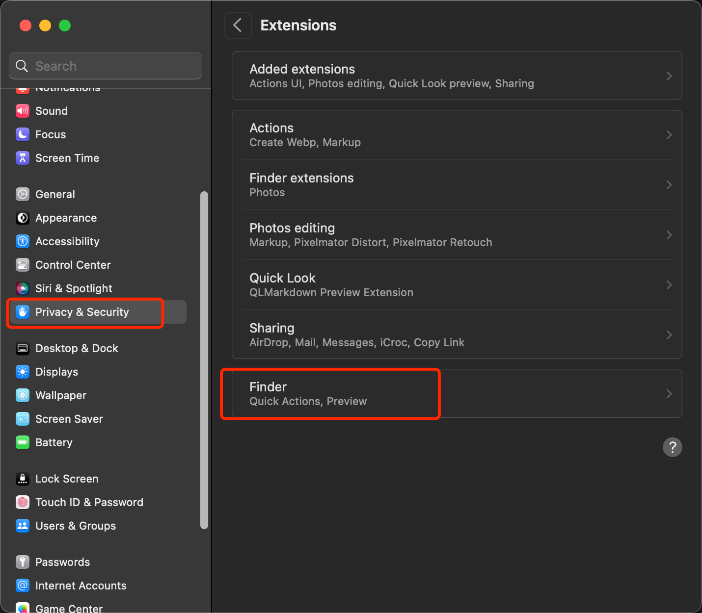
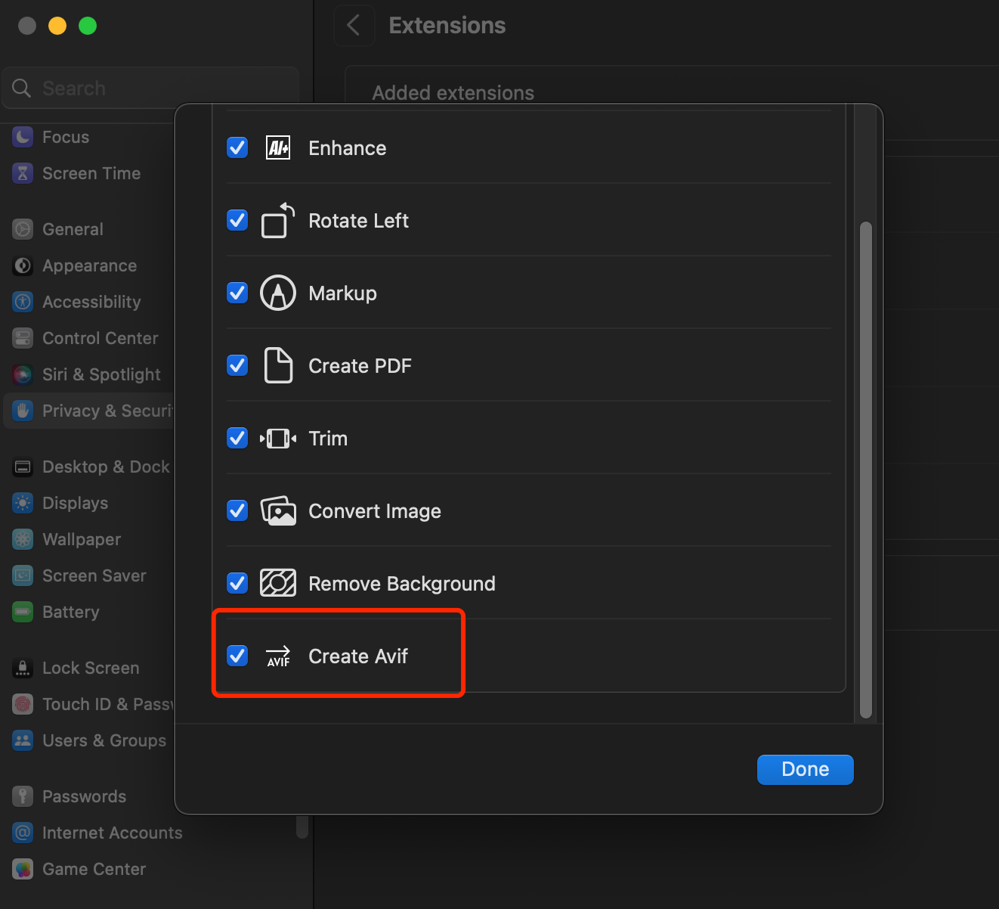
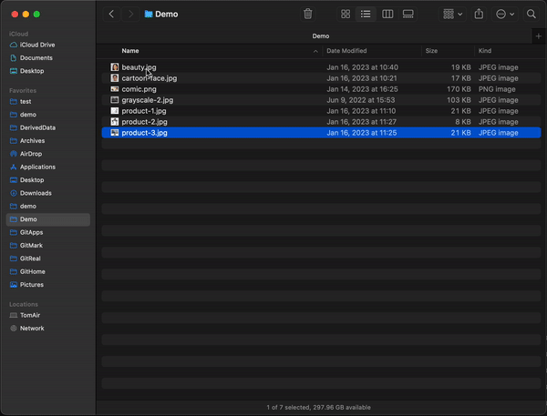

# Quick Avif - Batch convert images to .avif

Download [the latest release from macOS appstore](https://apps.apple.com/us/app/id1666267996)

## macOS active Quick Avif in Settings

## macOS Quick Avif preview
